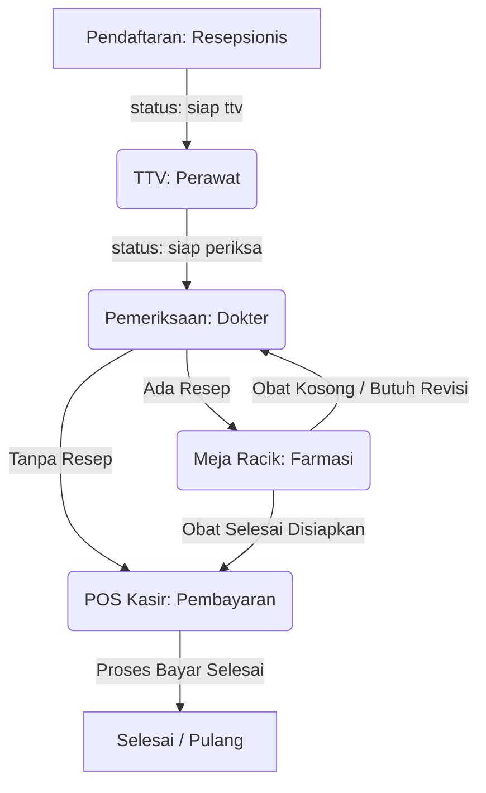

# Analisis Aktor, Status Antrean, dan Alur Proses Bisnis Klinik

Dokumen ini berisi analisis mendalam tentang hak akses pengguna (Role), status antrean pasien, dan alur proses bisnis klinik berdasarkan kode program aktual pada aplikasi *Clinic Management System*. Analisis ini menjadi fondasi utama dalam merancang sistem notifikasi yang tepat sasaran.

---

## 1. Pemetaan Aktor & Peran (User Roles)

Berdasarkan data seeder (`UserSeeder.php`) dan relasi pada model, terdapat 7 peran (*role*) dengan tugas spesifik:

| Nama Role | Sifat Tugas | Relasi Kunjungan (`Visit`) | Keterangan Fungsional |
| :--- | :--- | :--- | :--- |
| **`resepsionis` / `admin_fo`** | Kolektif (Pool) | `admin_id` | Melakukan registrasi pasien baru, menjadwalkan booking, dan menempatkan pasien ke antrean awal. |
| **`perawat`** | Personal / Spesifik | `nurse_id` | Melakukan pemeriksaan tanda-tanda vital (TTV) seperti berat badan, tinggi badan, tensi darah, dan suhu tubuh. |
| **`dokter`** | Personal / Spesifik | `doctor_id` | Melakukan pemeriksaan klinis utama (SOAP), menginput diagnosis (ICD-10), tindakan medis, dan meresepkan obat. |
| **`apoteker`** | Kolektif (Pool) | Tidak ada (diakses via Meja Racik) | Menyiapkan, meracik obat, mengemas, menulis aturan pakai (etiket), dan menyerahkan obat ke pasien. |
| **`kasir`** | Kolektif (Pool) | `cashier_id` (di `Payment`) | Mengonsolidasikan tagihan, memproses pembayaran, mencetak struk transaksi, dan menyelesaikan kunjungan. |
| **`admin`** | Pengawas | Tidak ada | Memantau seluruh aktivitas klinik, mengelola master data, HRD (payroll/jadwal), dan laporan keuangan. |

> [!NOTE]
> * **Sifat Personal/Spesifik:** Notifikasi harus dikirim secara eksklusif ke user ID yang bersangkutan (misal: jika pasien ditugaskan ke Dokter A, maka Dokter B tidak boleh menerima notifikasi tersebut).
> * **Sifat Kolektif (Pool):** Notifikasi dikirim ke seluruh staf yang memiliki role tersebut (misal: semua kasir/apoteker yang sedang aktif), karena antrean bersifat rebutan (*first-in-first-out*).

---

## 2. Status Antrean Pasien (Queue Statuses)

Sesuai definisi pada migrasi database tabel `visits`, status kunjungan pasien terbagi menjadi:

1.  **`terjadwal`**: Pasien telah melakukan booking (jadwal masa depan). Belum datang ke klinik.
2.  **`siap ttv`**: Pasien sudah hadir di klinik, sedang menunggu perawat untuk pemeriksaan vital signs.
3.  **`ttv`**: Perawat sedang melakukan input vital signs (tekanan darah, berat badan, dll.) di ruang pemeriksaan awal.
4.  **`siap periksa`**: Asesmen TTV selesai. Pasien mengantre menunggu panggilan dokter yang ditugaskan.
5.  **`periksa`**: Dokter sedang melakukan pemeriksaan utama dan mengisi rekam medis SOAP.
6.  **`tindakan`**: Dokter/Perawat sedang melakukan tindakan medis (misalnya jahit luka, injeksi, dll.) ke pasien.
7.  **`farmasi`**: Pemeriksaan medis selesai, resep obat dikirim ke meja racik farmasi untuk disiapkan.
8.  **`kasir`**: Penyiapan obat selesai (atau pemeriksaan selesai tanpa obat), pasien siap melakukan pembayaran.
9.  **`selesai`**: Kasir telah memproses pembayaran. Kunjungan pasien ditutup dan struk dicetak.
10. **`batal`**: Antrean pasien dibatalkan oleh resepsionis atau kasir (karena kesalahan input atau pasien pulang mendahului).

---

## 3. Alur Proses Bisnis Utama & Transisi Status

Berikut adalah visualisasi alur perpindahan status pasien dari pendaftaran hingga kepulangan:

### Tabel Transisi Status & Aksi Program

| Status Awal | Status Baru | Nama Transisi / Aksi | Kelas/File Pengendali | Pemicu (Trigger Action) |
| :--- | :--- | :--- | :--- | :--- |
| - | `siap ttv` | Registrasi Pasien Baru | `FrontOffice\Pendaftaran.php` | Menekan tombol "Simpan Kunjungan" |
| `terjadwal` | `siap ttv` | Check-in Booking Pasien | `FrontOffice\JadwalBooking.php` | Menekan tombol "Check-in Pasien" |
| `siap ttv` | `ttv` | Mulai TTV | `Medical\Queue.php` | Membuka form pemeriksaan awal pasien |
| `ttv` | `siap periksa` | Kirim ke Dokter | `Medical\SoapForm.php` | Mengklik "Submit SOAP" (dengan routing ke Dokter) |
| `siap periksa` | `periksa` | Mulai Periksa Dokter | `Medical\Queue.php` | Dokter membuka form SOAP pasien |
| `periksa` | `tindakan` | Input Tindakan Medis | `Medical\SoapForm.php` | Dokter menginput layanan/tindakan medis aktif |
| `periksa` / `tindakan` | `farmasi` | Kirim Resep ke Farmasi | `Medical\SoapForm.php` | Mengklik "Submit SOAP" (dengan routing ke Farmasi) |
| `periksa` / `tindakan` | `kasir` | Kirim Langsung ke Kasir | `Medical\SoapForm.php` | Mengklik "Submit SOAP" (dengan routing ke Kasir) |
| `farmasi` | `kasir` | Serah Terima Obat | `Pharmacy\MejaRacik.php` | Mengklik tombol "handoverMedicine()" |
| `farmasi` | `periksa` | Pengembalian Resep (Revisi) | `Pharmacy\MejaRacik.php` | Mengklik tombol "returnToDoctor()" |
| `kasir` | `selesai` | Pembayaran Lunas | `Cashier\Pembayaran.php` | Mengklik tombol "processPayment()" |
| `*` | `batal` | Batalkan Antrean | `Medical\Queue.php` / `Cashier\Pembayaran.php` | Mengonfirmasi pembatalan antrean total |
