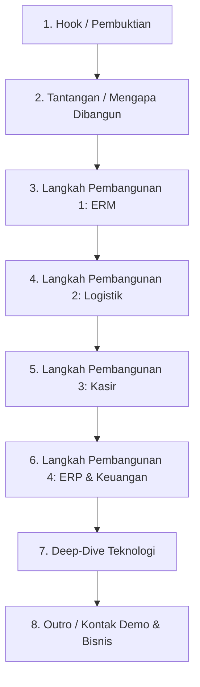

# Aturan Gaya Bahasa & Struktur Konten Video (Gaya "How I Built X")

Dokumen ini berisi panduan gaya penyampaian dan struktur konten untuk video presentasi produk/software yang kasual, edukatif, dan ramah (diadaptasi dari gaya vlogger teknologi/showcase portofolio seperti William Jakfar dan format video *"I Built an AI Trading System"*).

---

## 1. Kata Ganti Orang (Pronouns)
*   **Presenter:** Menggunakan **Saya** atau **Kita** (saat mengajak penonton menjelajah fitur bersama-sama).
*   **Penonton:** Menggunakan **Kamu** (membangun kedekatan personal, terasa seperti mengobrol dua arah dengan teman/rekan kerja).
*   **Larangan:** 
    *   Hindari kata **Gua/Lu** (terlalu kasual/jalanan untuk beberapa media sosial profesional seperti LinkedIn).
    *   Hindari kata **Anda/Pengguna** (terlalu kaku, dingin, dan formal seperti iklan korporat atau terjemahan).

---

## 2. Pilihan Kata & Kosakata (Diksi)
Gunakan padanan kata sehari-hari yang alami di telinga masyarakat Indonesia, hindari istilah baku yang terlalu formal:

| Kata Kaku / Baku | Padanan Kasual & Alami |
| :--- | :--- |
| Membuat | Bikin |
| Menggunakan | Pakai / Pake |
| Akan | Bakal |
| Bagaimana | Gimana |
| Terasa | Kerasa |
| Membantu | Ngebantu |
| Sangat Cepat | Kenceng / Lancar banget |
| Rumit / Kompleks | Ribet |
| Menyelesaikan | Selesain |
| Mengintegrasikan | Gabungin |
| Menginput | Nginput |
| Menghitung | Ngitung |
| Melihat | Ngeliat |

---

## 3. Struktur Konten (Format "How I Built X")
Struktur video tidak lagi seperti presentasi fitur yang kaku, melainkan sebuah **perjalanan membangun solusi (storytelling)**:

### Penjelasan Bagian Struktur:
1.  **Hook & Pembuktian (00:00 - 00:25)**: Langsung tunjukkan hasil akhir sistem yang sudah berjalan. Beri tahu penonton bahwa sistem ini dikembangkan untuk penelitian tugas akhir dan *sudah dipakai langsung oleh klien di dunia nyata*.
2.  **Tantangan/Masalah (00:25 - 00:45)**: Jelaskan rasa frustrasi mengapa sistem ini perlu dibuat (misal: sistem klinik tradisional yang terpisah-pisah antara medis, logistik obat, kasir, dan keuangan).
3.  **Langkah Pembangunan (00:45 - 02:45)**: Ceritakan proses integrasi modul secara bertahap (*"Pertama, kita selesaikan ERM..."*, *"Kedua, kita hubungkan ke Logistik..."*, *"Ketiga, kita buat Kasir..."*, *"Keempat, kita bangun otak keuangannya..."*).
4.  **Deep-Dive Teknologi (02:45 - 03:15)**: Tunjukkan di balik layar kodenya (Laravel 12, Livewire 4 SPA, Tailwind CSS 4) dan mengapa performanya kenceng tanpa loading halaman.
5.  **Outro & Hubungi (03:15 - selesai)**: Bagikan informasi kontak atau link untuk penonton yang berminat menjadwalkan private demo atau kolaborasi bisnis.
